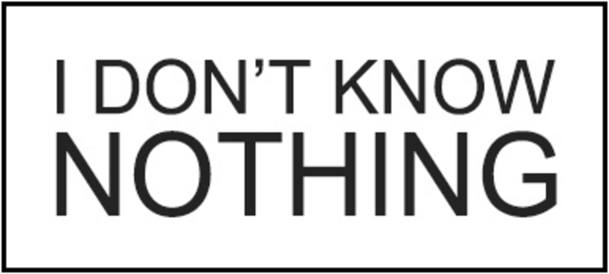

<!-- .slide: data-background="#fff" -->

#SoapUi
##Morosnídaně
15.01.2016 Hradec Králové

[https://github.com/octopuss/morosnidane-soapui](https://github.com/octopuss/morosnidane-soapui)

---

## Outline
-   SoapUI introduction
-   WebServices testing
-   WebServices mocking
-   WebServices security
-   REST testing

---

##SoapUI
- Testing tool for SOA and Web Service and REST.
- Mocking capabilities
- Load testing
- Maven/Jenkins integration

---

##WebServices testing
- TestSuites and TestSteps
- Many assert options
- Property transfer and expressions
- Groovy scripts

---

##WebServices mocking
- MockService from Wsdl
- Random responses using expressions

---

##WebService security
- For outgoing requests
- For decrypting responses
- For incoming requests to MockServices and their MockResponses.

---

##REST testing and mocking
- Almost same possibilities as WS testing

---

#Questions?

